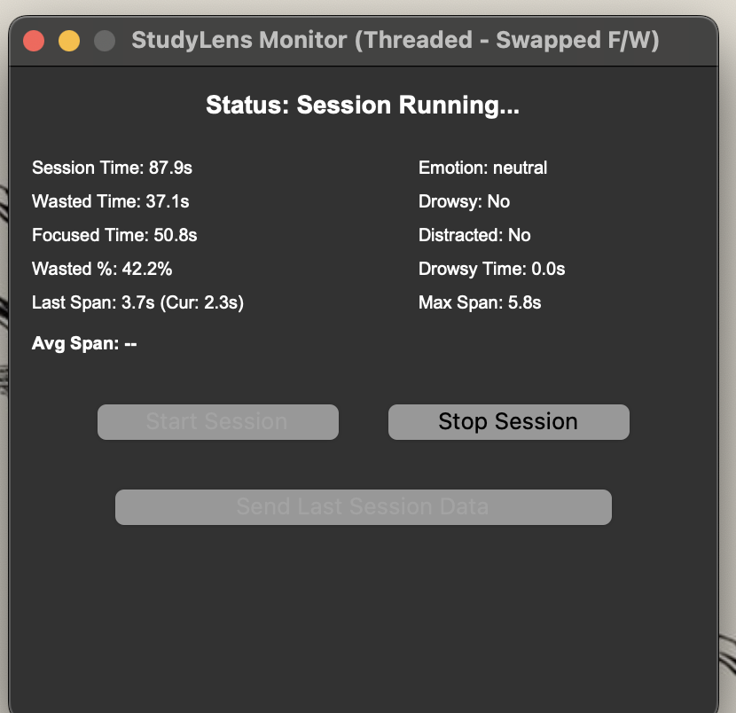

````markdown
# StudyLens: Local AI-Powered Study Session Analysis Tool

StudyLens is a desktop application designed to help users gain objective insights into their study habits by analyzing focus, drowsiness, and attention patterns using local AI processing.



## Features

- **Local Processing:** All video analysis happens on your computer, ensuring privacy. No video is ever uploaded.
- **Focus Tracking:** Monitors if you are actively engaged based on face presence and neutral emotion (using dlib & DeepFace).
- **Drowsiness Detection:** Detects potential drowsiness based on eye closure duration (using dlib & Eye Aspect Ratio).
- **Attention Span Calculation:** Estimates the duration of your focused periods, tracking the last span, maximum span, and average span per session.
- **Real-time Stats:** Displays Session Time, Focused Time, Wasted Time, Drowsy Time, and Attention Span metrics in the application window during a session.
- **Data Export (Manual):** Allows you to optionally send an anonymized statistical summary of your completed session to a web backend for further analysis and tracking.

## System Requirements

- **Operating System:**
  - Windows 10/11 (64-bit)
  - macOS 11 (Big Sur) or newer
- **Hardware:**
  - Modern CPU (Intel i3 / AMD Ryzen 3 or equivalent recommended)
  - 4GB RAM Minimum (8GB+ Recommended)
  - Webcam
  - ~500MB - 1GB Disk Space (for app and downloaded models)
- **Permissions:** Requires Camera access (OS will prompt).
- **Internet:** Required for initial application download, _first run only_ (to download AI models if not fully bundled), and optional data sending.

## Setup and Installation (From Source)

These instructions are for running the application directly from the Python source code. If you are using a pre-packaged version (`.app` or `.exe`), simply run that file.

**Prerequisites:**

1.  **Python:** Install Python 3.8 or newer from [python.org](https://www.python.org/). Make sure `pip` is included and added to your system's PATH.
2.  **CMake:** This is required to build the `dlib` library.
    - **macOS:** Install using Homebrew: `brew install cmake`
    - **Windows:** Download and install from [cmake.org](https://cmake.org/download/). Ensure it's added to your system's PATH during installation.
    - **Linux:** Use your package manager (e.g., `sudo apt update && sudo apt install cmake`).
3.  **(Windows Only) C++ Build Tools:** You need a C++ compiler. The easiest way is often to install the "Build Tools for Visual Studio" ([link](https://visualstudio.microsoft.com/visual-cpp-build-tools/)), making sure to select the "C++ build tools" workload during installation.

**Installation Steps:**

1.  **Clone the Repository:**

    ```bash
    git clone <URL_of_Your_GitHub_Repository>
    cd <repository-folder-name>/models/
    # Navigate into the directory containing app_main.py
    ```

2.  **Create a Virtual Environment:** (Recommended)

    ```bash
    python -m venv venv
    ```

3.  **Activate the Virtual Environment:**

    - **macOS / Linux:**
      ```bash
      source venv/bin/activate
      ```
    - **Windows (Command Prompt):**
      ```bash
      venv\Scripts\activate.bat
      ```
    - **Windows (PowerShell):**
      `bash
      .\venv\Scripts\Activate.ps1

    # If execution policy prevents this, run: Set-ExecutionPolicy -ExecutionPolicy RemoteSigned -Scope Process

    # Then try activating again.

    `  Your terminal prompt should now show`(venv)`.

4.  **Install Dependencies:**
    ```bash
    pip install -r requirements.txt
    ```
    _(**Note:** Ensure the provided `requirements.txt` file is accurate and present in the directory. The `dlib` installation might take several minutes as it compiles.)_

## Running the Application

1.  **Make sure your virtual environment is active.**
2.  **Navigate to the script directory:**
    ```bash
    cd /path/to/STUDYLENS/models/
    ```
3.  **Run the script:**
    ```bash
    python app_main.py
    ```

## Using the Application

1.  The main window will appear with the status "Status: Ready".
2.  Click **"Start Session"** to begin monitoring. Statistics will appear and update.
3.  Click **"Stop Session"** to end the current session. Final statistics (including Average Span) will be displayed, and the "Send Last Session Data" button will become active.
4.  Click **"Send Last Session Data"** (optional) to upload the anonymized session summary to the configured web server. A popup will indicate success or failure.
5.  Close the window using the standard close button (X) to quit the application.

## Configuration

- **API Endpoint:** If you intend to send data, ensure the `WEBSITE_API_URL` variable near the top of `app_main.py` is set to the correct backend URL.
- **Thresholds:** `EYE_AR_THRESH`, `EYE_AR_CONSEC_FRAMES`, and `DISTRACTION_CONSEC_FRAMES` can be adjusted in the configuration section of `app_main.py` to fine-tune detection sensitivity.

## Troubleshooting

- **dlib installation errors:** Ensure CMake and necessary C++ build tools (especially on Windows) are correctly installed _before_ running `pip install -r requirements.txt`.
- **Webcam Errors:** Check if another application is using the webcam. Ensure the application has necessary camera permissions from the operating system. Verify the correct camera is being selected (usually index `0` in `cv2.VideoCapture(0)`).
- **DeepFace Model Downloads:** The first time the application runs analysis (after clicking Start), it might pause while downloading required AI models from the internet. Ensure you have an active internet connection for this initial setup. These models are stored in `~/.deepface/weights`.
````
